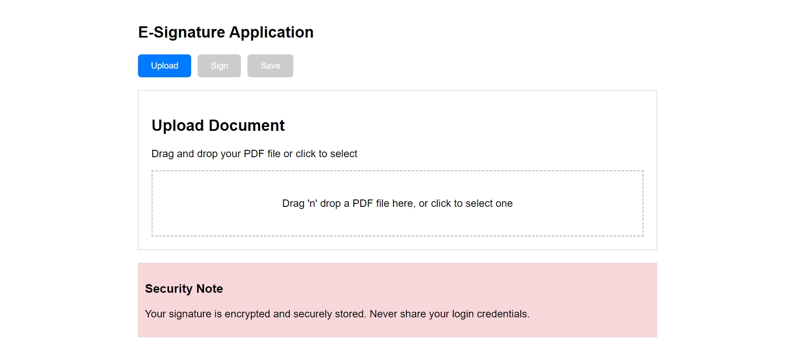
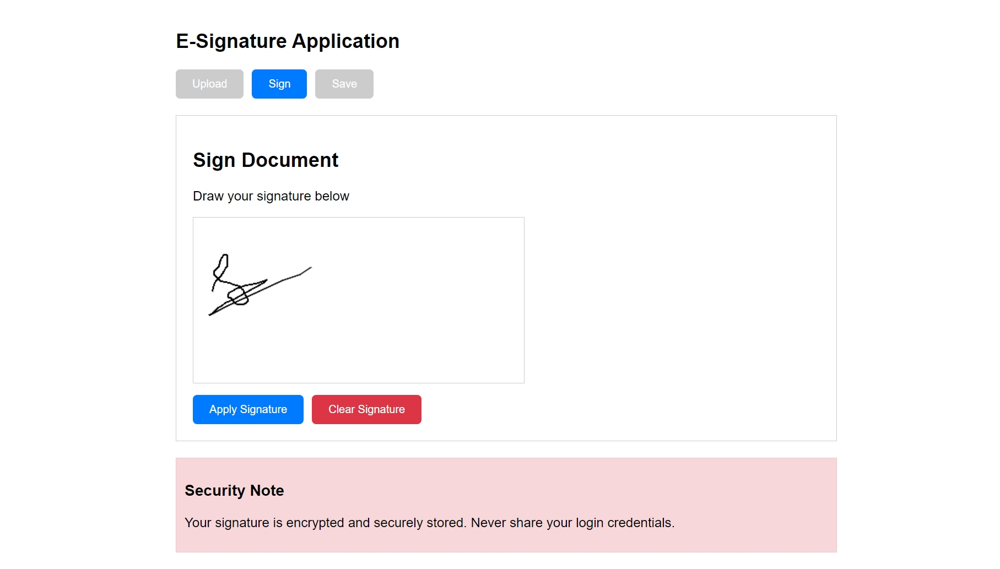
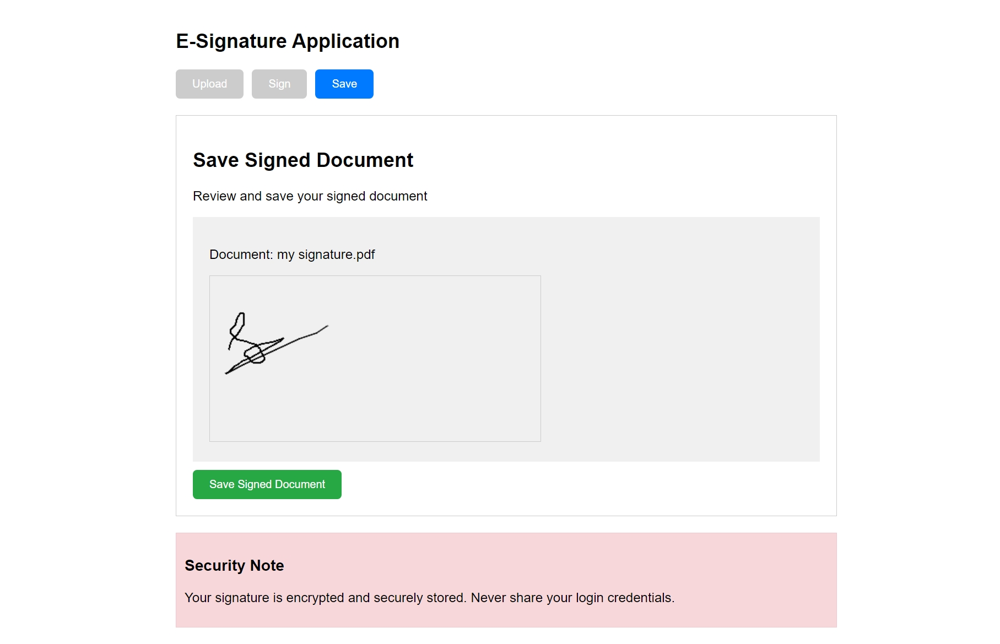

# E-Signature Application

This is a web-based application that allows users to upload a document, draw a digital signature, and save the signed document. The application is built using HTML, CSS, JavaScript, and related technologies, providing a simple interface for creating electronic signatures securely.

## Features
- **Upload Document**: Upload any document to be signed (e.g., PDF).
- **Draw Signature**: Draw a signature directly on the screen.
- **Save Signed Document**: Review and save the signed document.
- **Security**: Signature is encrypted and securely stored.

## Live Demo
You can view the live demo of this project at: [Demo Link](#) <!-- Add link when hosted -->

## Technologies Used

- React
- HTML5
- CSS3
- JavaScript

## Screenshots
 <!-- Add correct file paths -->
*Upload document functionality.*


*Draw your signature on the document.*


*Review and save your signed document.*

## How to Run Locally

1. **Clone the Repository**:
   ```bash
   git clone https://github.com/your-username/esignature-app.git
   ```
2. **Navigate to the project directory**:
   ```bash
   cd esignature-app
   ```
3. **Install dependencies** (if any):
   ```bash
   npm install
   ```

4. **Run the application**:
   Open the `index.html` file in your browser.

## Usage

1. Click on the **Upload** button to upload a PDF document.
2. Navigate to the **Sign** section to draw your signature.
3. After signing, you can review the signed document in the **Save** section.
4. Click **Save Signed Document** to save your signed document securely.


## Project Structure
```
/screenshots         # Folder for application screenshots
/index.html          # Main HTML file
/css                 # Folder for CSS files
/js                  # Folder for JavaScript files
/README.md           # Project documentation
```

## Future Enhancements
- **PDF Signature**: Enable signing PDFs directly.
- **Cloud Integration**: Save signed documents in cloud storage (Google Drive, etc.).
- **Email Functionality**: Send signed documents directly via email.

## Contributing
If you want to contribute:
1. Fork the project.
2. Create a feature branch (`git checkout -b feature/new-feature`).
3. Commit your changes (`git commit -m 'Add new feature'`).
4. Push to the branch (`git push origin feature/new-feature`).
5. Create a new Pull Request.


## Security Note

Your signature is encrypted and securely stored. Never share your login credentials.

## Contributing

Contributions are welcome! Please feel free to submit a pull request.

## License

This project is licensed under the MIT License.
